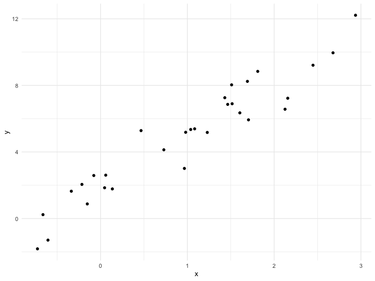

functions
================
Ekta Chaudhary
29/10/2019

We’re going to write some functions.

Here’s z scores

``` r
x = rnorm(n = 30, mean = 4, sd = 2.3)
x_again = rnorm(n = 30, mean = 6, sd = .3) 
y = rnorm(n = 30, mean = 24, sd = 2.3)
(x - mean(x)) / sd(x)
```

    ##  [1] -2.33944585  0.47200816  0.09402470  0.75455526  1.24020071
    ##  [6] -0.69688329 -1.82614096  0.78451019  0.23268661 -0.24290369
    ## [11] -1.01110642 -0.21328949 -0.61166887 -0.47071412 -0.36073106
    ## [16] -0.51255412 -0.03069487 -2.11073189  0.80152046  0.28870918
    ## [21]  0.93642565 -0.08123007 -0.18208080  2.08208215 -0.10820905
    ## [26] -0.26114951  0.45394318  1.72307251  0.29877560  0.89701971

``` r
(x_again - mean(x_again)) / sd(x_again)
```

    ##  [1] -1.21124250  0.29653526 -1.28538552  0.46732170 -0.19199688
    ##  [6] -0.69788536 -1.81965798 -0.50126792 -0.30918881 -1.55483233
    ## [11]  0.38703691 -0.42714412  0.04690609 -0.60229311  0.49737499
    ## [16]  0.59750309  1.99667252  0.45592118 -0.11629338 -0.21566297
    ## [21]  1.15240057 -0.75888837  1.12710374 -1.03413748  1.85882175
    ## [26]  2.11757210  0.70890256 -0.77069212 -0.34794547  0.13444187

Now a function.

``` r
z_score = function(x_arg) {
  
  if (!is.numeric(x_arg)) {
    stop("x should be numeric")
  } else if (length(x_arg) < 3) {
    stop("x should be longer than 3")
  } 
  
  (x_arg - mean(x_arg)) / sd(x_arg)
  
}
```

Try out the function.

``` r
z_score(x_arg = y)
```

    ##  [1] -0.94765969  0.75868596  0.45348442  0.64420640  0.74286533
    ##  [6]  0.56036983  1.75245871  0.66122519  0.15663893 -1.04522414
    ## [11] -1.12836301 -0.97442315 -0.88611038  0.57034302  0.06150948
    ## [16]  0.22789477  0.09642051 -1.16919584  1.56603171 -0.78509792
    ## [21]  0.56227179  1.68790088 -0.87526971 -2.18191091  0.61115328
    ## [26] -0.24558561  0.59880679 -0.36175510 -1.84952300  0.73785145

``` r
z_score(x_arg = 3)
```

    ## Error in z_score(x_arg = 3): x should be longer than 3

``` r
z_score(x_arg = "my name is jeff")
```

    ## Error in z_score(x_arg = "my name is jeff"): x should be numeric

``` r
z_score(x_arg = c(TRUE, TRUE, FALSE, TRUE))
```

    ## Error in z_score(x_arg = c(TRUE, TRUE, FALSE, TRUE)): x should be numeric

``` r
z_score(x_arg = iris)
```

    ## Error in z_score(x_arg = iris): x should be numeric

## Multiple outputs

``` r
mean_and_sd = function(input_x) {
  
  if (!is.numeric(input_x)) {
    stop("x should be numeric")
  } else if (length(input_x) < 3) {
    stop("x should be longer than 3")
  } 
  
  list(
    mean_input = mean(input_x),
    sd_input = sd(input_x),
    z_score = (input_x - mean(input_x)) / sd(input_x)
  )
  
}
```

test this function

``` r
mean_and_sd(input_x = y)
```

    ## $mean_input
    ## [1] 24.08842
    ## 
    ## $sd_input
    ## [1] 2.840744
    ## 
    ## $z_score
    ##  [1] -0.94765969  0.75868596  0.45348442  0.64420640  0.74286533
    ##  [6]  0.56036983  1.75245871  0.66122519  0.15663893 -1.04522414
    ## [11] -1.12836301 -0.97442315 -0.88611038  0.57034302  0.06150948
    ## [16]  0.22789477  0.09642051 -1.16919584  1.56603171 -0.78509792
    ## [21]  0.56227179  1.68790088 -0.87526971 -2.18191091  0.61115328
    ## [26] -0.24558561  0.59880679 -0.36175510 -1.84952300  0.73785145

## Multiple inputs

``` r
sim_data = tibble(
  x = rnorm(30, mean = 1, sd = 1),
  y = 2 + 3 * x + rnorm(30, 0, 1)
)
sim_data %>% 
  ggplot(aes(x = x, y = y)) + 
  geom_point()
```



``` r
ls_fit = lm(y ~ x, data = sim_data)
  
beta0_hat = coef(ls_fit)[1]
beta1_hat = coef(ls_fit)[2]
```

``` r
sim_regression = function(n, beta0 = 2, beta1 = 3) {
  
  sim_data = tibble(
    x = rnorm(n, mean = 1, sd = 1),
    y = beta0 + beta1 * x + rnorm(n, 0, 1)
  )
  
  ls_fit = lm(y ~ x, data = sim_data)
  
  tibble(
    beta0_hat = coef(ls_fit)[1], 
    beta1_hat = coef(ls_fit)[2] 
  )
  
}
sim_regression(n = 3000, beta0 = 17, beta1 = -3)
```

    ## # A tibble: 1 x 2
    ##   beta0_hat beta1_hat
    ##       <dbl>     <dbl>
    ## 1      17.0     -3.00

``` r
sim_regression(n = 14, beta0 = 24)
```

    ## # A tibble: 1 x 2
    ##   beta0_hat beta1_hat
    ##       <dbl>     <dbl>
    ## 1      23.1      3.38

## Scrape lots of napoleon

``` r
url = "https://www.amazon.com/product-reviews/B00005JNBQ/ref=cm_cr_arp_d_viewopt_rvwer?ie=UTF8&reviewerType=avp_only_reviews&sortBy=recent&pageNumber=1"
dynamite_html = read_html(url)
review_titles = 
  dynamite_html %>%
  html_nodes("#cm_cr-review_list .review-title") %>%
  html_text()
review_stars = 
  dynamite_html %>%
  html_nodes("#cm_cr-review_list .review-rating") %>%
  html_text()
review_text = 
  dynamite_html %>%
  html_nodes(".review-text-content span") %>%
  html_text()
reviews = tibble(
  title = review_titles,
  stars = review_stars,
  text = review_text
)
```

Now as a function

``` r
read_page_reviews = function(page_url) {
  
  dynamite_html = read_html(page_url)
  review_titles = 
    dynamite_html %>%
    html_nodes("#cm_cr-review_list .review-title") %>%
    html_text()
  review_stars = 
    dynamite_html %>%
    html_nodes("#cm_cr-review_list .review-rating") %>%
    html_text()
  
  review_text = 
    dynamite_html %>%
    html_nodes(".review-text-content span") %>%
    html_text()
  
  reviews = tibble(
    title = review_titles,
    stars = review_stars,
    text = review_text
  )
  
  reviews
    
}
```

Now i can read a lot of page reviews\! Although I’m back to
copy-and-pasting code
…

``` r
read_page_reviews("https://www.amazon.com/product-reviews/B00005JNBQ/ref=cm_cr_arp_d_viewopt_rvwer?ie=UTF8&reviewerType=avp_only_reviews&sortBy=recent&pageNumber=1")
```

    ## # A tibble: 10 x 3
    ##    title                   stars       text                                
    ##    <chr>                   <chr>       <chr>                               
    ##  1 "Gotta watch it!\n    … 5.0 out of… Super fun cult film. A must-see! Fu…
    ##  2 "Great movie\n        … 5.0 out of… Love this movie.                    
    ##  3 "Duh\n            "     5.0 out of… Best movie ever                     
    ##  4 "Great video\n        … 5.0 out of… Product as described.  Great transa…
    ##  5 "Give me some of your … 5.0 out of… This movie will always be my favori…
    ##  6 "Nostalgic\n          … 5.0 out of… One of the best nostalgic movies of…
    ##  7 "Make you giggle type … 5.0 out of… "I love, love, love this movie.  It…
    ##  8 "This movie is so stup… 5.0 out of… No, really.  It's so stupid.  Your …
    ##  9 "Hilarious\n          … 5.0 out of… Hilarious                           
    ## 10 "Waste of money\n     … 1.0 out of… Terrible movie! Please don’t waste …

``` r
read_page_reviews("https://www.amazon.com/product-reviews/B00005JNBQ/ref=cm_cr_arp_d_viewopt_rvwer?ie=UTF8&reviewerType=avp_only_reviews&sortBy=recent&pageNumber=2")
```

    ## # A tibble: 10 x 3
    ##    title                       stars      text                             
    ##    <chr>                       <chr>      <chr>                            
    ##  1 "Good movie\n            "  5.0 out o… Funny                            
    ##  2 "A classic\n            "   5.0 out o… I like your sleeves. They're rea…
    ##  3 "FRIKKEN SWEET MOVIE, GAWS… 5.0 out o… It’s Napolean Dynamite. It’s cha…
    ##  4 "You gonna eat the rest of… 5.0 out o… One of my favorite movies ever. …
    ##  5 "Tina you fat lard come ge… 5.0 out o… It's a great movie               
    ##  6 "Great family movie\n     … 5.0 out o… My kids as well as the adults lo…
    ##  7 "Teens love it\n          … 5.0 out o… Original and funny               
    ##  8 "Great\n            "       5.0 out o… Funny                            
    ##  9 "Great Movie, Bad Packagin… 4.0 out o… First off, the stick-on label on…
    ## 10 "jeez napoleon\n          … 5.0 out o… gosh

``` r
read_page_reviews("https://www.amazon.com/product-reviews/B00005JNBQ/ref=cm_cr_arp_d_viewopt_rvwer?ie=UTF8&reviewerType=avp_only_reviews&sortBy=recent&pageNumber=3")
```

    ## # A tibble: 10 x 3
    ##    title                     stars       text                              
    ##    <chr>                     <chr>       <chr>                             
    ##  1 "👍\n            "        5.0 out of… 👍                                
    ##  2 "A classic!\n           … 5.0 out of… A classic movie.  Hilarious!      
    ##  3 "A must own\n           … 5.0 out of… Great movie                       
    ##  4 "If you like 80s ...you … 5.0 out of… My all time favorite movie. I hav…
    ##  5 "🤘\n            "        5.0 out of… 🤘                                
    ##  6 "Super Slow Mooovie...\n… 1.0 out of… Too slow and too damn quiet... My…
    ##  7 "Awesome!\n            "  5.0 out of… Love this movie !                 
    ##  8 "Very funny\n           … 4.0 out of… Very funny                        
    ##  9 "Eat your food tina\n   … 5.0 out of… Cant go wrong                     
    ## 10 "Dumb funny\n           … 5.0 out of… Dumb funny

``` r
read_page_reviews("https://www.amazon.com/product-reviews/B00005JNBQ/ref=cm_cr_arp_d_viewopt_rvwer?ie=UTF8&reviewerType=avp_only_reviews&sortBy=recent&pageNumber=4")
```

    ## # A tibble: 10 x 3
    ##    title                         stars      text                           
    ##    <chr>                         <chr>      <chr>                          
    ##  1 "Annoying! Not in a good way… 1.0 out o… I know that I am one of the ve…
    ##  2 "Fun\n            "           5.0 out o… Fun                            
    ##  3 "such a great movie\n       … 5.0 out o… a true comedy classic          
    ##  4 "Napoleon Dud\n            "  3.0 out o… Not impressed w/movie.         
    ##  5 "Five stars\n            "    5.0 out o… Such a weird, awesome movie    
    ##  6 "Fun!\n            "          5.0 out o… Great movie                    
    ##  7 "Funny movie- bravo for Amaz… 5.0 out o… My son loves this movie, so I …
    ##  8 "Movie\n            "         5.0 out o… Movie                          
    ##  9 "Funny movie, quotable lines… 5.0 out o… My kids quote this movie all t…
    ## 10 "Great for teenagers!\n     … 5.0 out o… My students loved this movie.

## Scoping

Mean example …

``` r
f = function(x) {
  z = x + y
  z
}
x = 1
y = 2
f(x = 2)
```

    ## [1] 4

``` r
l = list(vec_numeric = 5:8,
         mat         = matrix(1:8, 2, 4),
         vec_logical = c(TRUE, FALSE),
         summary     = summary(rnorm(1000)))
l
```

    ## $vec_numeric
    ## [1] 5 6 7 8
    ## 
    ## $mat
    ##      [,1] [,2] [,3] [,4]
    ## [1,]    1    3    5    7
    ## [2,]    2    4    6    8
    ## 
    ## $vec_logical
    ## [1]  TRUE FALSE
    ## 
    ## $summary
    ##     Min.  1st Qu.   Median     Mean  3rd Qu.     Max. 
    ## -3.41754 -0.65731 -0.02298 -0.02795  0.60083  3.28384

``` r
l$vec_numeric
```

    ## [1] 5 6 7 8

``` r
l$summary
```

    ##     Min.  1st Qu.   Median     Mean  3rd Qu.     Max. 
    ## -3.41754 -0.65731 -0.02298 -0.02795  0.60083  3.28384

``` r
mean(l$vec_numeric)
```

    ## [1] 6.5

``` r
l[[2]]
```

    ##      [,1] [,2] [,3] [,4]
    ## [1,]    1    3    5    7
    ## [2,]    2    4    6    8

``` r
df = list(
  a = rnorm(20, 3, 1),
  b = rnorm(20, 0, 5),
  c = rnorm(20, 10, .2),
  d = rnorm(20, -3, 1)
)

df$a
```

    ##  [1] 4.0593048 1.2195263 3.5133919 3.3644304 2.2358654 3.5569423 3.1268334
    ##  [8] 2.3278146 2.9283416 2.3435294 4.4580285 3.5117500 4.1144850 3.2315653
    ## [15] 4.4796611 1.4326422 0.3273113 1.9197497 2.6807459 3.4579210

``` r
df$b
```

    ##  [1]  -1.3500987   3.8792386  12.4225497 -10.0320087   4.9428003
    ##  [6]   0.1527505   8.9605915  -1.1598054   5.3121752  -0.7044732
    ## [11]   3.6689319  -1.9267847  -2.6464011 -10.3480656  -0.6965453
    ## [16]  -8.7220980  12.1468938   2.3611265  -0.7809287   7.6736435

``` r
df[[2]] #pulling out the second thing from the list 
```

    ##  [1]  -1.3500987   3.8792386  12.4225497 -10.0320087   4.9428003
    ##  [6]   0.1527505   8.9605915  -1.1598054   5.3121752  -0.7044732
    ## [11]   3.6689319  -1.9267847  -2.6464011 -10.3480656  -0.6965453
    ## [16]  -8.7220980  12.1468938   2.3611265  -0.7809287   7.6736435

``` r
mean_and_sd = function(x) {
  
  if (!is.numeric(x)) {
    stop("Argument x should be numeric")
  } else if (length(x) == 1) {
    stop("Cannot be computed for length 1 vectors")
  }
  
  mean_x = mean(x)
  sd_x = sd(x)

  tibble(
    mean = mean_x, 
    sd = sd_x
  )
}

mean_and_sd(df[[2]])
```

    ## # A tibble: 1 x 2
    ##    mean    sd
    ##   <dbl> <dbl>
    ## 1  1.16  6.49

Using a for loop instead of repeating the above calculation again and
again \!

``` r
output = vector("list", length = 4)

for (i in 1:4) {
  
  output[[i]] = mean_and_sd(df[[i]])
}
```

Using map to do the same thing \!\!

``` r
output = map(df, mean_and_sd)
output_median = map(df,median)
output_summary = map(df,summary)
```
