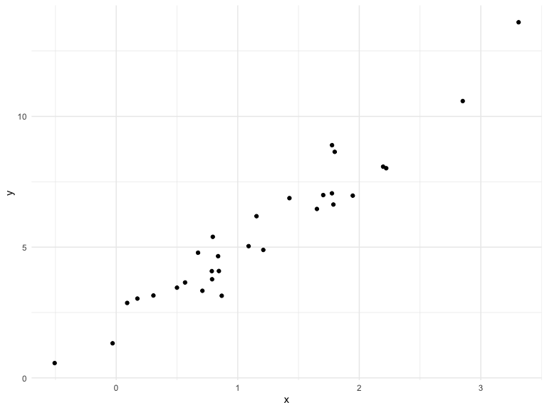

functions
================
Ekta Chaudhary
29/10/2019

We’re going to write some functions.

Here’s z scores

``` r
x = rnorm(n = 30, mean = 4, sd = 2.3)
x_again = rnorm(n = 30, mean = 6, sd = .3) 
y = rnorm(n = 30, mean = 24, sd = 2.3)
(x - mean(x)) / sd(x)
```

    ##  [1]  0.58026768 -0.11825752 -2.87554889  0.28462470 -0.09397682
    ##  [6]  0.29782962  0.42899193 -0.44432030  0.56308195  2.00769678
    ## [11]  0.51206782 -1.26327719 -0.73421250 -0.49098523  0.95421672
    ## [16]  1.01295814  1.61591692 -0.22495546 -1.23619795  0.18781181
    ## [21] -1.40481836  0.65389638 -0.76364063 -0.46917839  0.10876888
    ## [26] -0.08038211 -0.49050085  0.59549183 -0.66610148  1.55273252

``` r
(x_again - mean(x_again)) / sd(x_again)
```

    ##  [1]  1.016796714 -0.976733123 -0.772982331 -1.223759940 -0.944957056
    ##  [6]  1.264421928 -1.951238343 -0.460998324 -0.042677051  1.467400405
    ## [11] -0.053244802  1.185086031 -0.646910748  0.109652175 -2.703067895
    ## [16]  1.123507797 -0.662154928 -0.156361882  1.304244271  0.067135279
    ## [21]  0.364775213 -0.304865251  0.178491060  1.339865908  0.440643151
    ## [26]  0.229159961  0.004010919  0.938839018 -0.559528468  0.425450313

Now a function.

``` r
z_score = function(x_arg) {
  
  if (!is.numeric(x_arg)) {
    stop("x should be numeric")
  } else if (length(x_arg) < 3) {
    stop("x should be longer than 3")
  } 
  
  (x_arg - mean(x_arg)) / sd(x_arg)
  
}
```

Try out the function.

``` r
z_score(x_arg = y)
```

    ##  [1]  1.41564891 -0.49020862 -0.32792866 -0.46571375  1.39250216
    ##  [6]  0.56257896  0.01145836 -0.50416852 -0.90907772 -1.10907571
    ## [11] -1.43553949  1.76650861 -1.84027609  1.24863088 -0.26212009
    ## [16] -0.18114763 -0.99434172 -1.31818409  0.69069175  0.81524976
    ## [21] -0.91282147 -0.87553381  1.22518313  1.44121782  0.68781638
    ## [26]  0.81437665  0.89097409 -0.64829551 -0.38259808 -0.30580652

``` r
z_score(x_arg = 3)
```

    ## Error in z_score(x_arg = 3): x should be longer than 3

``` r
z_score(x_arg = "my name is jeff")
```

    ## Error in z_score(x_arg = "my name is jeff"): x should be numeric

``` r
z_score(x_arg = c(TRUE, TRUE, FALSE, TRUE))
```

    ## Error in z_score(x_arg = c(TRUE, TRUE, FALSE, TRUE)): x should be numeric

``` r
z_score(x_arg = iris)
```

    ## Error in z_score(x_arg = iris): x should be numeric

## Multiple outputs

``` r
mean_and_sd = function(input_x) {
  
  if (!is.numeric(input_x)) {
    stop("x should be numeric")
  } else if (length(input_x) < 3) {
    stop("x should be longer than 3")
  } 
  
  list(
    mean_input = mean(input_x),
    sd_input = sd(input_x),
    z_score = (input_x - mean(input_x)) / sd(input_x)
  )
  
}
```

test this function

``` r
mean_and_sd(input_x = y)
```

    ## $mean_input
    ## [1] 23.68843
    ## 
    ## $sd_input
    ## [1] 2.399296
    ## 
    ## $z_score
    ##  [1]  1.41564891 -0.49020862 -0.32792866 -0.46571375  1.39250216
    ##  [6]  0.56257896  0.01145836 -0.50416852 -0.90907772 -1.10907571
    ## [11] -1.43553949  1.76650861 -1.84027609  1.24863088 -0.26212009
    ## [16] -0.18114763 -0.99434172 -1.31818409  0.69069175  0.81524976
    ## [21] -0.91282147 -0.87553381  1.22518313  1.44121782  0.68781638
    ## [26]  0.81437665  0.89097409 -0.64829551 -0.38259808 -0.30580652

## Multiple inputs

``` r
sim_data = tibble(
  x = rnorm(30, mean = 1, sd = 1),
  y = 2 + 3 * x + rnorm(30, 0, 1)
)
sim_data %>% 
  ggplot(aes(x = x, y = y)) + 
  geom_point()
```



``` r
ls_fit = lm(y ~ x, data = sim_data)
  
beta0_hat = coef(ls_fit)[1]
beta1_hat = coef(ls_fit)[2]
```

``` r
sim_regression = function(n, beta0 = 2, beta1 = 3) {
  
  sim_data = tibble(
    x = rnorm(n, mean = 1, sd = 1),
    y = beta0 + beta1 * x + rnorm(n, 0, 1)
  )
  
  ls_fit = lm(y ~ x, data = sim_data)
  
  tibble(
    beta0_hat = coef(ls_fit)[1], 
    beta1_hat = coef(ls_fit)[2] 
  )
  
}
sim_regression(n = 3000, beta0 = 17, beta1 = -3)
```

    ## # A tibble: 1 x 2
    ##   beta0_hat beta1_hat
    ##       <dbl>     <dbl>
    ## 1      17.0     -2.98

``` r
sim_regression(n = 14, beta0 = 24)
```

    ## # A tibble: 1 x 2
    ##   beta0_hat beta1_hat
    ##       <dbl>     <dbl>
    ## 1      24.1      2.87

## Scrape lots of napoleon

``` r
url = "https://www.amazon.com/product-reviews/B00005JNBQ/ref=cm_cr_arp_d_viewopt_rvwer?ie=UTF8&reviewerType=avp_only_reviews&sortBy=recent&pageNumber=1"
dynamite_html = read_html(url)
review_titles = 
  dynamite_html %>%
  html_nodes("#cm_cr-review_list .review-title") %>%
  html_text()
review_stars = 
  dynamite_html %>%
  html_nodes("#cm_cr-review_list .review-rating") %>%
  html_text()
review_text = 
  dynamite_html %>%
  html_nodes(".review-text-content span") %>%
  html_text()
reviews = tibble(
  title = review_titles,
  stars = review_stars,
  text = review_text
)
```

Now as a function

``` r
read_page_reviews = function(page_url) {
  
  dynamite_html = read_html(page_url)
  review_titles = 
    dynamite_html %>%
    html_nodes("#cm_cr-review_list .review-title") %>%
    html_text()
  review_stars = 
    dynamite_html %>%
    html_nodes("#cm_cr-review_list .review-rating") %>%
    html_text()
  
  review_text = 
    dynamite_html %>%
    html_nodes(".review-text-content span") %>%
    html_text()
  
  reviews = tibble(
    title = review_titles,
    stars = review_stars,
    text = review_text
  )
  
  reviews
    
}
```

Now i can read a lot of page reviews\! Although I’m back to
copy-and-pasting code
…

``` r
read_page_reviews("https://www.amazon.com/product-reviews/B00005JNBQ/ref=cm_cr_arp_d_viewopt_rvwer?ie=UTF8&reviewerType=avp_only_reviews&sortBy=recent&pageNumber=1")
```

    ## # A tibble: 10 x 3
    ##    title                   stars       text                                
    ##    <chr>                   <chr>       <chr>                               
    ##  1 "Gotta watch it!\n    … 5.0 out of… Super fun cult film. A must-see! Fu…
    ##  2 "Great movie\n        … 5.0 out of… Love this movie.                    
    ##  3 "Duh\n            "     5.0 out of… Best movie ever                     
    ##  4 "Great video\n        … 5.0 out of… Product as described.  Great transa…
    ##  5 "Give me some of your … 5.0 out of… This movie will always be my favori…
    ##  6 "Nostalgic\n          … 5.0 out of… One of the best nostalgic movies of…
    ##  7 "Make you giggle type … 5.0 out of… "I love, love, love this movie.  It…
    ##  8 "This movie is so stup… 5.0 out of… No, really.  It's so stupid.  Your …
    ##  9 "Hilarious\n          … 5.0 out of… Hilarious                           
    ## 10 "Waste of money\n     … 1.0 out of… Terrible movie! Please don’t waste …

``` r
read_page_reviews("https://www.amazon.com/product-reviews/B00005JNBQ/ref=cm_cr_arp_d_viewopt_rvwer?ie=UTF8&reviewerType=avp_only_reviews&sortBy=recent&pageNumber=2")
```

    ## # A tibble: 10 x 3
    ##    title                       stars      text                             
    ##    <chr>                       <chr>      <chr>                            
    ##  1 "Good movie\n            "  5.0 out o… Funny                            
    ##  2 "A classic\n            "   5.0 out o… I like your sleeves. They're rea…
    ##  3 "FRIKKEN SWEET MOVIE, GAWS… 5.0 out o… It’s Napolean Dynamite. It’s cha…
    ##  4 "You gonna eat the rest of… 5.0 out o… One of my favorite movies ever. …
    ##  5 "Tina you fat lard come ge… 5.0 out o… It's a great movie               
    ##  6 "Great family movie\n     … 5.0 out o… My kids as well as the adults lo…
    ##  7 "Teens love it\n          … 5.0 out o… Original and funny               
    ##  8 "Great\n            "       5.0 out o… Funny                            
    ##  9 "Great Movie, Bad Packagin… 4.0 out o… First off, the stick-on label on…
    ## 10 "jeez napoleon\n          … 5.0 out o… gosh

``` r
read_page_reviews("https://www.amazon.com/product-reviews/B00005JNBQ/ref=cm_cr_arp_d_viewopt_rvwer?ie=UTF8&reviewerType=avp_only_reviews&sortBy=recent&pageNumber=3")
```

    ## # A tibble: 10 x 3
    ##    title                     stars       text                              
    ##    <chr>                     <chr>       <chr>                             
    ##  1 "👍\n            "        5.0 out of… 👍                                
    ##  2 "A classic!\n           … 5.0 out of… A classic movie.  Hilarious!      
    ##  3 "A must own\n           … 5.0 out of… Great movie                       
    ##  4 "If you like 80s ...you … 5.0 out of… My all time favorite movie. I hav…
    ##  5 "🤘\n            "        5.0 out of… 🤘                                
    ##  6 "Super Slow Mooovie...\n… 1.0 out of… Too slow and too damn quiet... My…
    ##  7 "Awesome!\n            "  5.0 out of… Love this movie !                 
    ##  8 "Very funny\n           … 4.0 out of… Very funny                        
    ##  9 "Eat your food tina\n   … 5.0 out of… Cant go wrong                     
    ## 10 "Dumb funny\n           … 5.0 out of… Dumb funny

``` r
read_page_reviews("https://www.amazon.com/product-reviews/B00005JNBQ/ref=cm_cr_arp_d_viewopt_rvwer?ie=UTF8&reviewerType=avp_only_reviews&sortBy=recent&pageNumber=4")
```

    ## # A tibble: 10 x 3
    ##    title                         stars      text                           
    ##    <chr>                         <chr>      <chr>                          
    ##  1 "Annoying! Not in a good way… 1.0 out o… I know that I am one of the ve…
    ##  2 "Fun\n            "           5.0 out o… Fun                            
    ##  3 "such a great movie\n       … 5.0 out o… a true comedy classic          
    ##  4 "Napoleon Dud\n            "  3.0 out o… Not impressed w/movie.         
    ##  5 "Five stars\n            "    5.0 out o… Such a weird, awesome movie    
    ##  6 "Fun!\n            "          5.0 out o… Great movie                    
    ##  7 "Funny movie- bravo for Amaz… 5.0 out o… My son loves this movie, so I …
    ##  8 "Movie\n            "         5.0 out o… Movie                          
    ##  9 "Funny movie, quotable lines… 5.0 out o… My kids quote this movie all t…
    ## 10 "Great for teenagers!\n     … 5.0 out o… My students loved this movie.

## Scoping

Mean example …

``` r
f = function(x) {
  z = x + y
  z
}
x = 1
y = 2
f(x = 2)
```

    ## [1] 4

``` r
l = list(vec_numeric = 5:8,
         mat         = matrix(1:8, 2, 4),
         vec_logical = c(TRUE, FALSE),
         summary     = summary(rnorm(1000)))
l
```

    ## $vec_numeric
    ## [1] 5 6 7 8
    ## 
    ## $mat
    ##      [,1] [,2] [,3] [,4]
    ## [1,]    1    3    5    7
    ## [2,]    2    4    6    8
    ## 
    ## $vec_logical
    ## [1]  TRUE FALSE
    ## 
    ## $summary
    ##     Min.  1st Qu.   Median     Mean  3rd Qu.     Max. 
    ## -3.30811 -0.71835 -0.01381 -0.01695  0.64959  3.34357

``` r
l$vec_numeric
```

    ## [1] 5 6 7 8

``` r
l$summary
```

    ##     Min.  1st Qu.   Median     Mean  3rd Qu.     Max. 
    ## -3.30811 -0.71835 -0.01381 -0.01695  0.64959  3.34357

``` r
mean(l$vec_numeric)
```

    ## [1] 6.5

``` r
l[[2]]
```

    ##      [,1] [,2] [,3] [,4]
    ## [1,]    1    3    5    7
    ## [2,]    2    4    6    8

``` r
df = list(
  a = rnorm(20, 3, 1),
  b = rnorm(20, 0, 5),
  c = rnorm(20, 10, .2),
  d = rnorm(20, -3, 1)
)

df$a
```

    ##  [1] 4.7390416 0.7712713 2.8475321 3.8437905 3.6307879 3.3373286 1.7210783
    ##  [8] 2.9015539 2.6196408 4.9390217 2.1607895 2.8495668 3.6190925 1.9493898
    ## [15] 3.7145132 3.0924931 2.2401760 2.9143444 3.1490224 2.6306714

``` r
df$b
```

    ##  [1]  -9.33897796  -0.11202238   4.82281397  -6.52494006   0.07996222
    ##  [6]  -4.25628612   0.60133521  -1.80786315  -2.59422757   0.46689196
    ## [11]  -5.98875771   9.73741546   2.46362380  -1.74795022 -10.58331924
    ## [16]  -0.44679672   4.03983836  -0.14551590   0.38693545  -3.12298832

``` r
df[[2]] #pulling out the second thing from the list 
```

    ##  [1]  -9.33897796  -0.11202238   4.82281397  -6.52494006   0.07996222
    ##  [6]  -4.25628612   0.60133521  -1.80786315  -2.59422757   0.46689196
    ## [11]  -5.98875771   9.73741546   2.46362380  -1.74795022 -10.58331924
    ## [16]  -0.44679672   4.03983836  -0.14551590   0.38693545  -3.12298832

``` r
mean_and_sd = function(x) {
  
  if (!is.numeric(x)) {
    stop("Argument x should be numeric")
  } else if (length(x) == 1) {
    stop("Cannot be computed for length 1 vectors")
  }
  
  mean_x = mean(x)
  sd_x = sd(x)

  tibble(
    mean = mean_x, 
    sd = sd_x
  )
}

mean_and_sd(df[[2]])
```

    ## # A tibble: 1 x 2
    ##    mean    sd
    ##   <dbl> <dbl>
    ## 1 -1.20  4.76

Using a for loop instead of repeating the above calculation again and
again \!

``` r
output = vector("list", length = 4)

for (i in 1:4) {
  
  output[[i]] = mean_and_sd(df[[i]])
}
```

Using map to do the same thing \!\!

``` r
output = map(df, mean_and_sd)
output_median = map(df,median)
output_summary = map(df,summary)
output_median = map_dbl(df,median)
output = map_dfr(df,median)

output = map(df, ~mean_and_sd(.x))
```

\#Napolean

``` r
library(rvest)

read_page_reviews = function(url) {
  
  h = read_html(url)
  
  title = h %>%
    html_nodes("#cm_cr-review_list .review-title") %>%
    html_text()
  
  stars = h %>%
    html_nodes("#cm_cr-review_list .review-rating") %>%
    html_text() %>%
    str_extract("\\d") %>%
    as.numeric()
  
  text = h %>%
    html_nodes(".review-data:nth-child(5)") %>%
    html_text()
  
  data_frame(title, stars, text)
}
```

``` r
url_base = "https://www.amazon.com/product-reviews/B00005JNBQ/ref=cm_cr_arp_d_viewopt_rvwer?ie=UTF8&reviewerType=avp_only_reviews&sortBy=recent&pageNumber="
vec_urls = str_c(url_base, 1:5)

read_page_reviews(vec_urls[[1]])
```

    ## # A tibble: 10 x 3
    ##    title                     stars text                                    
    ##    <chr>                     <dbl> <chr>                                   
    ##  1 "Gotta watch it!\n      …     5 "Super fun cult film. A must-see! Funni…
    ##  2 "Great movie\n          …     5 "Love this movie.\n            "        
    ##  3 "Duh\n            "           5 "Best movie ever\n            "         
    ##  4 "Great video\n          …     5 "Product as described.  Great transacti…
    ##  5 "Give me some of your to…     5 "This movie will always be my favorite …
    ##  6 "Nostalgic\n            "     5 "One of the best nostalgic movies of my…
    ##  7 "Make you giggle type mo…     5 "I love, love, love this movie.  It mak…
    ##  8 "This movie is so stupid…     5 "No, really.  It's so stupid.  Your IQ …
    ##  9 "Hilarious\n            "     5 "Hilarious\n            "               
    ## 10 "Waste of money\n       …     1 "Terrible movie! Please don’t waste you…

``` r
read_page_reviews(vec_urls[[2]])
```

    ## # A tibble: 10 x 3
    ##    title                         stars text                                
    ##    <chr>                         <dbl> <chr>                               
    ##  1 "Good movie\n            "        5 "Funny\n            "               
    ##  2 "A classic\n            "         5 "I like your sleeves. They're real …
    ##  3 "FRIKKEN SWEET MOVIE, GAWSH.…     5 "It’s Napolean Dynamite. It’s charm…
    ##  4 "You gonna eat the rest of y…     5 "One of my favorite movies ever.  Y…
    ##  5 "Tina you fat lard come get …     5 "It's a great movie\n            "  
    ##  6 "Great family movie\n       …     5 "My kids as well as the adults love…
    ##  7 "Teens love it\n            "     5 "Original and funny\n            "  
    ##  8 "Great\n            "             5 "Funny\n            "               
    ##  9 "Great Movie, Bad Packaging\…     4 "First off, the stick-on label on t…
    ## 10 "jeez napoleon\n            "     5 "gosh\n            "

``` r
read_page_reviews(vec_urls[[2]])
```

    ## # A tibble: 10 x 3
    ##    title                         stars text                                
    ##    <chr>                         <dbl> <chr>                               
    ##  1 "Good movie\n            "        5 "Funny\n            "               
    ##  2 "A classic\n            "         5 "I like your sleeves. They're real …
    ##  3 "FRIKKEN SWEET MOVIE, GAWSH.…     5 "It’s Napolean Dynamite. It’s charm…
    ##  4 "You gonna eat the rest of y…     5 "One of my favorite movies ever.  Y…
    ##  5 "Tina you fat lard come get …     5 "It's a great movie\n            "  
    ##  6 "Great family movie\n       …     5 "My kids as well as the adults love…
    ##  7 "Teens love it\n            "     5 "Original and funny\n            "  
    ##  8 "Great\n            "             5 "Funny\n            "               
    ##  9 "Great Movie, Bad Packaging\…     4 "First off, the stick-on label on t…
    ## 10 "jeez napoleon\n            "     5 "gosh\n            "

Intead of doing the above steps again and again, we can use the for loop
and map \!

``` r
output = vector("list", 5)

for (i in 1:5) {
  output[[i]] = read_page_reviews(vec_urls[[i]])
}
```

Using map for the same \!\!

``` r
output = map(vec_urls,read_page_reviews)
```
